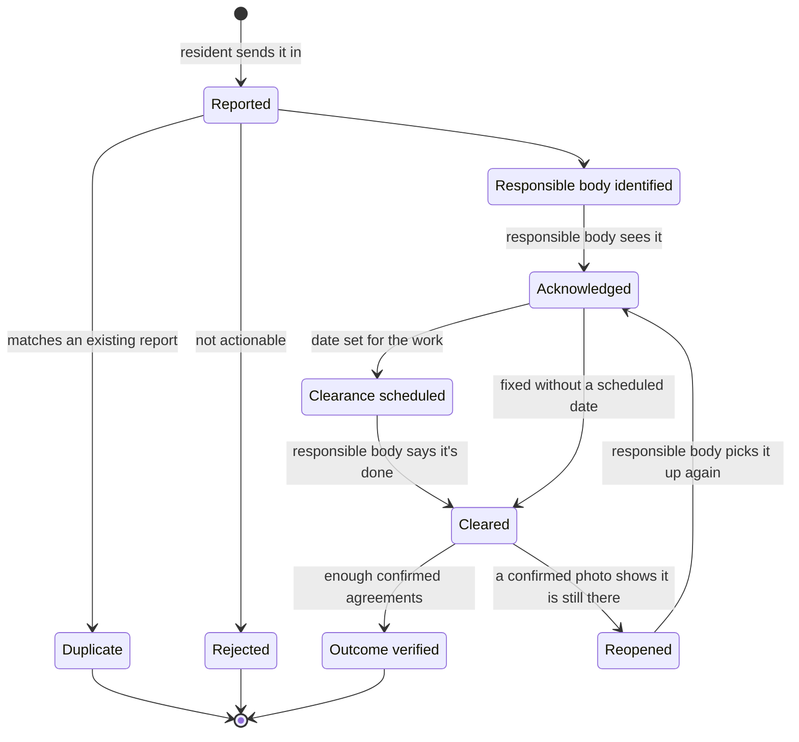
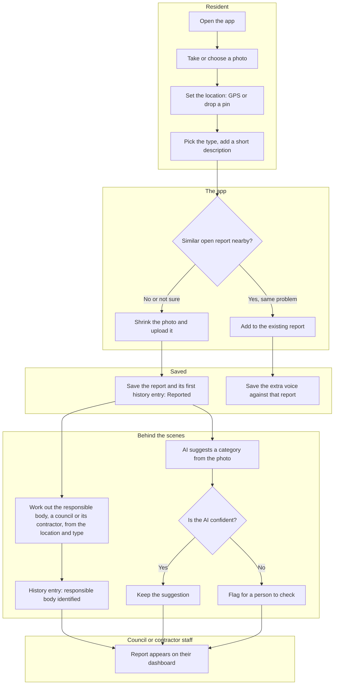
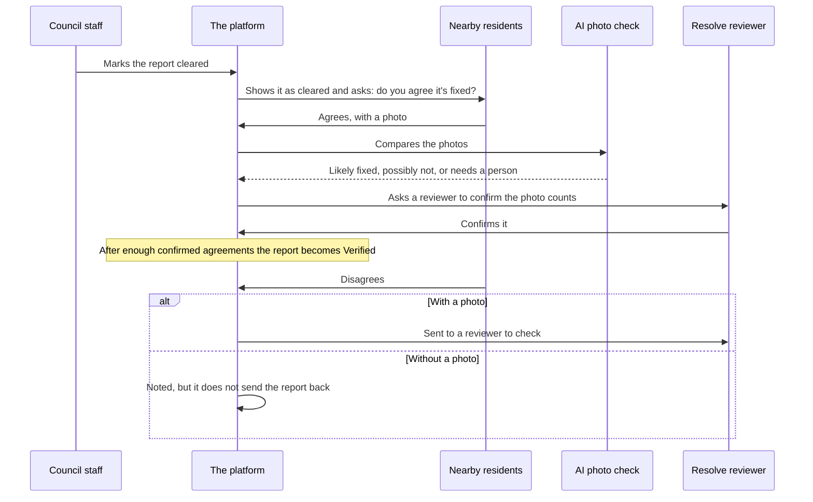
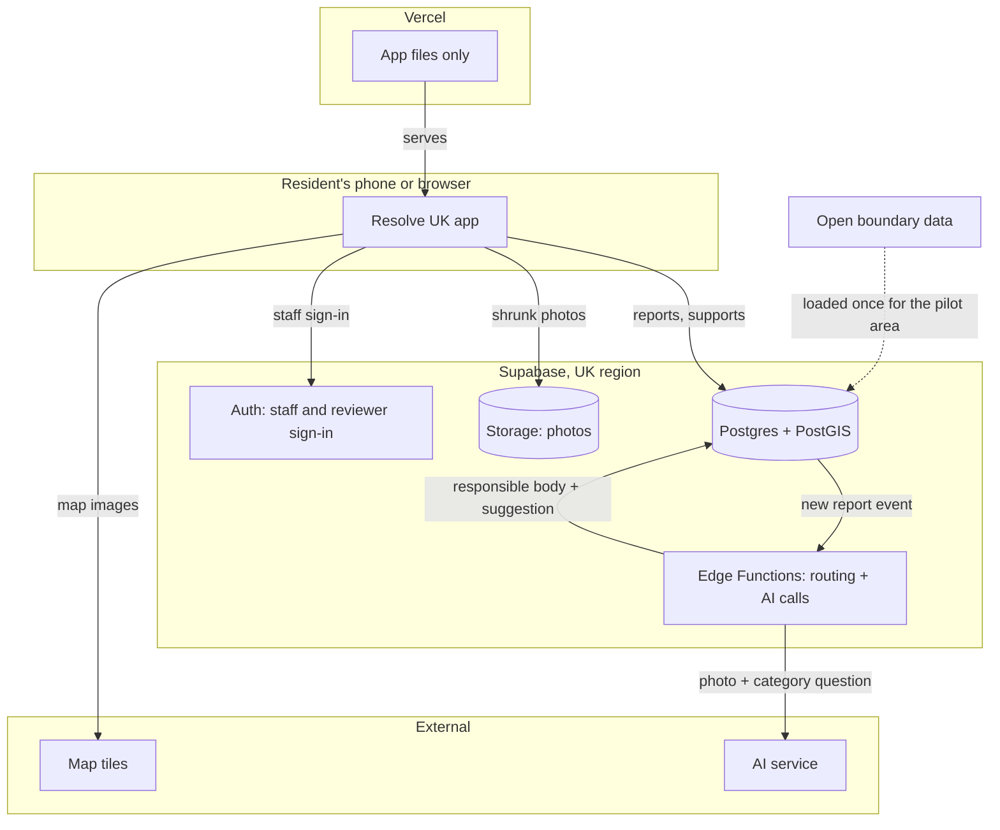
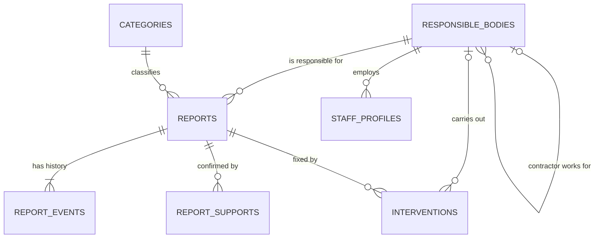

## Summary

This is my plan for taking Resolve UK from the working prototype to something councils can actually use. It covers how a report travels from a photo on someone's phone to a confirmed fix, what I would build and in what order, and the questions I need your help with before going further.

It's based on the two emails you sent after the Week 1 report, and on your reply to the first version of this plan. Apart from the prototype, nothing described here has been built yet, so please read it as a draft. If something is wrong or missing, tell me and I'll change the plan before I build.

In short:

- A resident reports a problem. Staff at the responsible council or its contractor sign in to acknowledge it, schedule the work and mark it cleared. They only see reports for their own area, and they cannot verify their own work.
- The public is then shown that the problem has been cleared and asked whether they agree, with a photo. Once enough people agree, the report counts as verified. A Resolve reviewer can sign in to see everything and to verify, without being able to change what the council has done.
- The data will be hosted in the UK.
- I would start with a safe home for the data and a dashboard for whoever handles reports. The first three stages come to about 4.5 to 8.5 weeks of work. The routing and checking stage is the pilot, and it depends on a council agreeing to take part.

The time estimates are rough guesses. Licence terms and which council covers what also still need checking before I rely on them.

## How a report moves

Every report goes through the same set of stages. The middle ones are the stages you described: reported, responsible body identified, acknowledged, clearance scheduled, cleared and outcome verified. I've added three for when things don't go smoothly: duplicate, rejected and reopened. By "responsible body" I mean the council, or a contractor the council uses for that kind of work.

*Figure 1. The stages a report can move through.*

One distinction matters more than the rest. When the responsible body marks a job as cleared, that's its own word. A report only becomes verified when independent people agree, with photos, that it's fixed. Keeping those two apart is what makes it possible to say how many fixes are genuinely confirmed.

Councils sign in to acknowledge, schedule and clear. They cannot verify. Each council only sees the reports for its own area, so London cannot see Manchester's. A Resolve view shows everything, and reviewers can verify from it, but cannot change what a council has done.

| Stage | What it means | Who sets it |
|---|---|---|
| Reported | Someone has sent it in. | The resident |
| Responsible body identified | The system knows who should deal with it: the council, or a contractor it uses. | Set automatically, or by staff |
| Acknowledged | The responsible body has seen it. | Council or contractor staff |
| Clearance scheduled | A date for the work is set. | Council or contractor staff |
| Cleared | The responsible body says the job is done. | Council or contractor staff |
| Outcome verified | Enough independent people agree, with photos, that it's fixed. | The platform, once a Resolve reviewer has confirmed the photos |
| Reopened | A confirmed photo shows the problem is still there. | A Resolve reviewer |
| Duplicate | It matches a report already made. | The resident when they send it, or staff |
| Rejected | Not something the responsible body can act on. | Council or contractor staff |

## Sending in a report

In the prototype, someone takes a photo, chooses a type and marks the spot. The next version adds a few steps behind the scenes.

*Figure 2. What happens when someone sends in a report.*

Before the report is saved, the app looks for an open report of the same type nearby and asks the person whether it's the same problem. If it is, their report is added to the existing one instead of creating a duplicate. I'd ask rather than merge automatically, because a wrong guess would hide a genuine second problem. I'd start with a distance of about 10 to 20 metres for potholes and 25 to 50 metres for other problems, then adjust once real reports come in.

The system then works out who is responsible from the location and the type of problem. That is usually a council, but councils often hand some of the work, such as waste clearance or road repairs, to a contractor, so the report can go to the contractor instead. Location alone isn't always enough. In areas with two levels of council, the county usually looks after potholes and the district looks after fly-tipping, which is why you noted that the level of council depends on the problem. I'll confirm who covers what, and who the contractors are, in the pilot area before relying on this.

The AI also suggests a category from the photo. If the AI isn't confident in its suggestion, the report is flagged for a person to look at.

## Checking a fix

When the responsible body marks a report as cleared, the app shows the public that it has been cleared and asks the people nearby, and anyone who backed the report, whether they agree it's fixed. Agreeing means sending a photo. The AI compares the photos and gives one of three answers: likely fixed, possibly not fixed, or needs a person to look. A Resolve reviewer then confirms whether the photo counts.

*Figure 3. How a fix gets checked.*

My draft rule, based on your reply, is this:

- A report becomes verified after 5 confirmed agreements, each with a photo. Five was your suggestion, and it's still a decision to confirm.
- Someone who disagrees without sending a photo doesn't count, and doesn't send the report back. Some people are just difficult, as you said.
- Someone who disagrees with a photo sends the report to a Resolve reviewer to check.
- If nobody responds, the report stays cleared but unverified, and is counted that way, so the verification figures stay honest.

Two points are still open, and are on the Decisions page: who checks each photo, and what happens in a remote area where 5 residents may never reply.

## Measuring results

Every change of stage is saved with the time it happened. That's what makes it possible to work out the figures in your benchmarking example. For instance:

- The number of days until the council marks a report cleared, for each council and each contractor. It stops at "cleared", not "verified", so that councils in remote areas aren't penalised when a problem was dealt with quickly but few people were around to confirm it.
- The share of reports cleared within five days.
- The share of cleared reports that were later verified.
- How often a problem returns to the same spot, meaning a new report close to one that was already fixed.

Hotspot maps and trends come later, once there's enough data for them to mean something.

## Order of work

I'd build in stages, each on top of the one before.

| Stage | What it adds | Hours | About how long |
|---|---|---|---|
| Foundation | A new database in the UK, a fuller set of issue types (fly-tipping, potholes, graffiti, abandoned vehicles, damaged infrastructure), smaller photos, councils and their contractors set up as responsible bodies, and the groundwork for recording each stage change and each intervention (what was done to fix a problem, and what it cost). | 10 to 20 | 1 to 2 weeks |
| Community | The "is this the same problem?" check, a count of people backing a report, and a public feed showing each report's progress. | 12 to 24 | 1.5 to 2.5 weeks |
| Staff dashboard | Sign-in for council staff, who see only their own area, plus a Resolve view of everything for reviewers. A list, map and filters, and buttons to acknowledge, schedule and clear. | 24 to 40 | 2.5 to 4 weeks |
| AI help | Suggested categories with a confidence level, checked by staff. Needs extra time to tune on real reports. | 10 to 20 | 1 to 2 weeks |
| Pilot: routing and checking fixes | Automatic routing to the right council or contractor for the pilot area, the public "do you agree it's fixed?" step with photos, and the verification rule. | 27 to 49 | 2.5 to 5 weeks |
| More AI checks | Naming the type of waste, estimating how much there is, and flagging items that look hazardous so they're escalated. Needs plenty of real reports to tune against, so I haven't sized it. | Later | Later |
| Following an area | Alerts about problems near a place, for example within a mile of a village, and a view of an area's open problems for community groups. Needs a way to send alerts, so it comes after the core stages. | Later | Later |
| Comparing performance | Public pages with comparable performance and outcome measures for councils and contractors. Needs months of real data first, so I haven't sized it. | Later | Later |

The first three stages come to roughly 46 to 84 hours, or 4.5 to 8.5 weeks. With AI help it's 56 to 104 hours, or 5.5 to 10.5 weeks. These are rough guesses and could be out by half again either way. They assume about 10 hours a week on Resolve UK, because my time is shared with another project. The pilot stage also depends on a council taking part, so no number of hours can promise it.

Week

123456789101112

Foundation

1.5 wk

Community

2 wk

Staff dashboard

3 wk

AI help

1.5 wk

Pilot: routing and checking fixes<small>needs a council</small>

4 wk

*Figure 4. The stages laid out over weeks, at about 10 hours a week. The dashed bar is the pilot, and it depends on a council agreeing to take part. If another project takes priority for a while, everything moves later.*

## Where this leads

Your second email described three phases. This plan builds the first one. The other two come later, because they depend on having real data.

| Phase | What it covers | When |
|---|---|---|
| 1. Report, route, track, resolve, verify | Everything in the stages above. | This plan |
| 2. Analyse, compare, spot recurring problems | Hotspots, comparable performance measures for councils and contractors, and places where the same problem keeps coming back. | After months of real reports |
| 3. Predict, intervene, measure | Predictive hotspot identification and preventative intervention, then checking whether the intervention worked. | Later, once there's enough good data |

Prediction isn't part of the first build. It needs enough good-quality data to build and check, so I'd put it on the roadmap rather than promise it at launch.

What makes all of this possible is the record. As you put it, the valuable part is the closed loop: the problem, the response, what was done about it, the outcome, and whether it came back. So from the first real report, the system saves each stage change with its time, and each intervention with what was done, who did it and what it cost, even though the analysis comes later.

Over time that data could be useful to government, waste operators, insurers, housing associations, researchers and the media. That's a question for later, but keeping the records consistent from the start is what keeps it open.

One item on your list, repeat offenders, needs care, because tying reports to individual people raises data protection questions. I'd start with repeat locations, which don't.

Once there are enough real reports to tune against, the AI checks can also name the type of waste, estimate how much there is, and flag items that look hazardous so they're escalated. Following an area, for example "tell me about problems within a mile of my village", is planned for later too. It needs a way to send alerts, so it comes after the core stages.

## Your questions, and my answers

These are the questions you asked after the Week 1 report, with my answers. Where you've since made a decision, it's noted here and recorded on the Decisions page.

### What does "shipped" mean?

Sorry, that section was too technical. It just means what's finished and working. You can open the prototype on a phone, report a problem with a photo and a location, and see it show up in a list. I rewrote it in plain language in the Week 1 report.

### What are the timing requirements for the next steps?

I can't give firm dates yet, but the first three stages should take about 4.5 to 8.5 weeks, or up to 10.5 with the AI part. That's at about 10 hours a week on Resolve UK, because my time is split with another project. If you'd rather one of the two came first, tell me and I'll adjust. Anything that needs a council can't be dated until one is on board. The full breakdown is under Order of work.

### Where is the data, and what would it take to move it?

At the moment the prototype's data is in Seoul, South Korea. I picked that region for convenience while building, and it only holds test reports. You've said UK hosting is best, so that's decided: the data moves to a UK location before any real reports come in. UK law doesn't ban storing data abroad, but it adds extra requirements, and councils will most likely ask for UK hosting anyway.

Moving now is easy because there's nothing real to move. It's about an hour or two of work and costs nothing extra. Doing it later, with real reports and photos in the database, is harder and riskier. So I'd do it first, in London, and set it up under an account that can be handed over to you or your organisation. I'm also changing how photos are stored so a later move can't break their links.

### What happens when the free usage runs out, and what does it cost?

The prototype runs on free plans for the database and photos (Supabase) and for the website (Vercel). Photo storage would run out first. The free plan has about 1 GB, and full-size phone photos are 3 to 5 MB each, so that's a few hundred reports. Shrinking photos when they're uploaded fixes most of that. If the limit were hit, uploads could stop working, so I'd upgrade before then.

The paid plans start at $25 a month for Supabase and $20 a month for Vercel, so about $45 a month for a pilot, plus the cost of the AI features once I know how many reports to expect. Vercel's free plan is for non-commercial use only, so a real pilot should be on the paid one anyway. I checked both companies' pricing pages on 20 September 2026 and these figures were current then. Supabase's price can rise if a project goes beyond its included allowance, and Vercel's covers one developer, with each extra developer costing another $20 a month.

### Can you match a report's location to others nearby, to stop duplicates?

Yes. Before a report is saved, the app can check for an open report of the same type nearby and ask the person whether it's the same problem. I'd ask rather than merge automatically, because a wrong guess could hide a real second problem. The distance is still to be decided. I'd start at about 10 to 20 metres for potholes and 25 to 50 for other problems, then adjust once real reports come in. It also gives you the shared view of an incident that you described. Sending in a report shows where it fits.

### Surely most people have GPS on?

You're right that most phones have it and most people will allow it, so most locations will be fine. I'd still keep the manual pin, for a few reasons. GPS is only accurate to about 5 to 20 metres, and worse between tall buildings. People often report later from home, when the phone's location is their house. And some people will be on a computer or will say no to location sharing. So the app uses GPS first, lets people correct it, and records how accurate it was. It's a small risk, not a big one.

### Which area would you suggest for the first pilot?

You suggested Huddersfield or Colchester, depending on whether a council agrees, which is outside your control.

Huddersfield is the simpler technical start: one council covers potholes, fly-tipping and the rest there, so reports have one place to go. Colchester is your preference if it's as easy, and it's your home town, which may open doors. As far as I know it has two levels of council, with the county looking after roads and the city council looking after fly-tipping and waste, so a report there can need routing to either. The plan already handles that, but it means a little more setup. I still need to check who covers what in both places.

## Technical appendix

This part is for whoever builds or takes over the system. Everyone else can skip straight to the questions at the end.

### How the pieces connect

*Figure 5. Where the data lives and which parts talk to each other.*

The AI key stays inside a server-side function and never reaches the browser. Vercel only serves the app's files and holds no data.

### Data model

The main change from the prototype is that a report's history becomes a list of entries that only ever grows. The current status is then a shortcut copied from the latest entry, not the source of truth.

*Figure 6. How the tables relate to each other. The fields in each table are listed underneath.*

| Table | Fields |
|---|---|
| responsible_bodies | id, name, kind (council or contractor), tier (unitary, county or district; councils only), works_for_id (the council a contractor works for), functions (for example highways, waste, streetscene), boundary (councils only) |
| categories | code, label, function (which responsibility owns this type of issue) |
| reports | id, category_code, description, location, location_accuracy_m, location_source (gps or manual), photo_path, responsible_body_id (empty until routed), current_status (copied from the latest history entry), ai_category, ai_confidence, duplicate_of, created_at |
| report_events | id, report_id, status, actor_type (citizen, staff, reviewer, ai or system), actor_id, note, photo_path, data (extra details), created_at |
| report_supports | id, report_id, device_token, kind (same_issue, still_there or fixed), photo_path, ai_result, review_status (pending, confirmed or rejected), reviewed_by, created_at |
| interventions | id, report_id, body_id, type (cleared, camera, barrier, signage, enforcement or other), description, cost_pence (optional), done_at |
| staff_profiles | id (same as the sign-in id), body_id, role (staff, reviewer or resolve_admin), display_name |

Photos are stored by path, not full URL, so moving to a new project never breaks a link. Location accuracy is kept so the nearby check can allow for GPS error. Interventions record what was done about a problem, by whom, and what it cost.

Routing picks the council whose boundary contains the point and whose responsibilities include the issue type. If that council has a contractor for that kind of work, the report goes to the contractor. That handles areas where the county and district split the work. Following an area will need an extra `area_follows` table, which comes with that later stage.

### Who can see and change what

| Who | Reports | History | Photos |
|---|---|---|---|
| Public | Read. Create with type, description, location and photo only. Cannot set status or responsible body. Can agree or disagree that a fix worked, with a photo. | Read the status timeline. | Read (decision pending). |
| Council or contractor staff | Read reports for their own area only. | Add acknowledge, schedule and clear entries for their own area. Cannot add verification. | Upload evidence photos. |
| Resolve reviewer | Read everything. | Add verification entries. Cannot change or remove anything a council added. | Read everything. |
| Resolve admin | Everything, plus manage responsible bodies, issue types and accounts. | Everything. | Everything. |
| Nobody | Deletes reports. | Edits or deletes past entries (admin exceptions only). | Not applicable. |

These rules are enforced in the database itself (row-level security), not only in the app, so a bug in the app can't quietly expose data.

### What changes in the current prototype

- Issue types grow from three to five: fly-tipping, potholes, graffiti, abandoned vehicles and damaged infrastructure.
- The form records GPS accuracy, and photos are shrunk before upload and stored by path.
- Submitting also writes the first history entry, and the list shows the status timeline instead of a single word.
- New: sign-in for council staff and reviewers, and the dashboard. The Supabase keys move to the new UK project.

### Handover checklist

- Accounts (Supabase, Vercel, GitHub) sit in organisations that can be handed over by adding the new owner, not by sharing a password. Two-factor sign-in is on.
- The database structure lives in the repository as migration files, so the whole database can be recreated in any region or account.
- The README lists every environment variable, how to deploy, and how to rotate keys. Secrets live in each platform's secret store, never in chat or email.
- Backups are decided on purpose. The free tier may not include them, so confirm before real data arrives.
- There is a list of every third-party service used, with what it costs and who pays.
